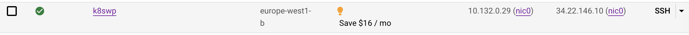

# Final GlobalLogic Task
[Final Home task](https://docs.google.com/spreadsheets/d/1hCm05lSvmcVh1KWKIYPqspxD7yAmPqEnAop6t6pv8bU/edit#gid=0)

#### 1. Creating infrastructure (Instance with external IP, managed MySQL DB) in GCP using Terraform
   Clone repository from Github
   ```
   git clone https://github.com/Heckfy05/Final_Task_GL.git
   ```
   Please determine your Terraform [veriables](https://github.com/Heckfy05/Final_Task_GL/raw/main/Terraform/variables.tf) for successful deploying 
   Inintialize [Terraform](https://developer.hashicorp.com/terraform/tutorials/aws-get-started/install-cli) in folder Terraform
   

   ```
   trraform init
   ```
   To avoid, any surprise have a look at what tricky HashiCorp tool going to do and only after that apply creatin infrastucture
   ```
   terraform plane
   terraform apply
   ```
   As result, successfully created infrastructure
   
   
   
   

#### 2. Deploying K8s single-node cluster using Kubespray on created instances. Using Ansible proforming basic hardening (keyless-only ssh, unattended upgrade, firewall)
2.1 Deploying K8s cluster using detailed [instruction](https://docs.google.com/document/d/11-mHm1BWdKFaEm9HdaeALvvulKDESyGm/edit)

2.2 Performing Hardening using [Ansible roles](Ansible/playbook.yml)

#### 3. Deploying WordPress on single-node Kubernetes cluster using Ansible-playbook
In advance was registered host name at [dynv6.com](https://dynv6.com), allowed external access for K8s cluster to MySQL DB and detailed DB credentials in [Deployment.yaml](Ansible/roles/K8S_WP/wp/Deployment.yaml)

Applying [Ansible-playbook](Ansible/playbook.yml) for configuring k8s and deploying Word Press
```
Ansible-playbook playbook.yml
```
As result, we successfully deployed WordPress on K8s cluster


